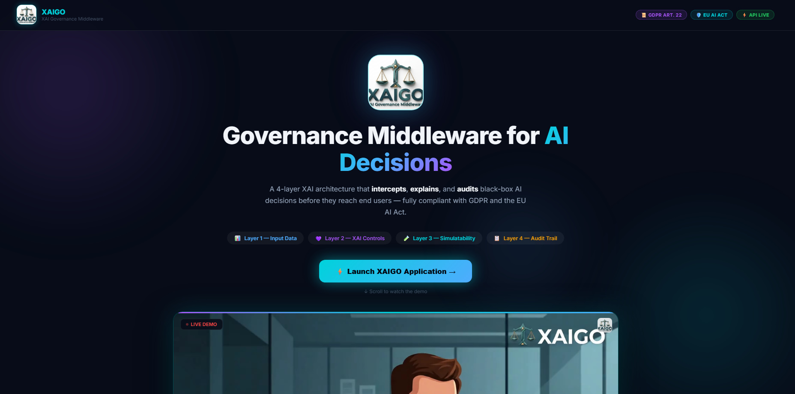
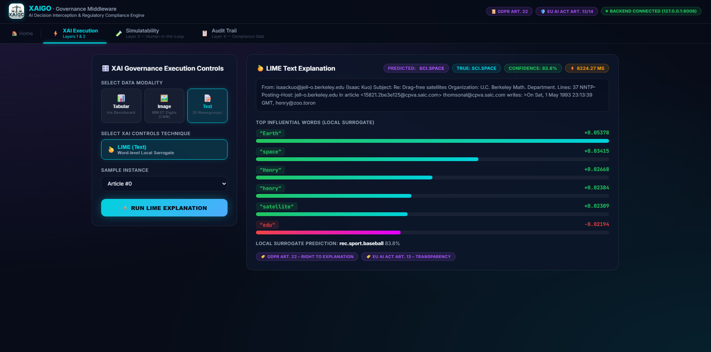
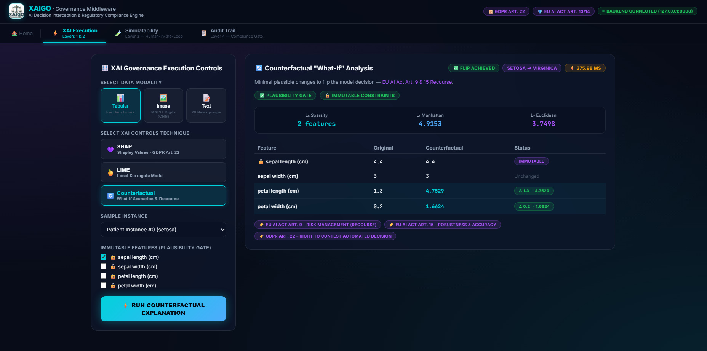
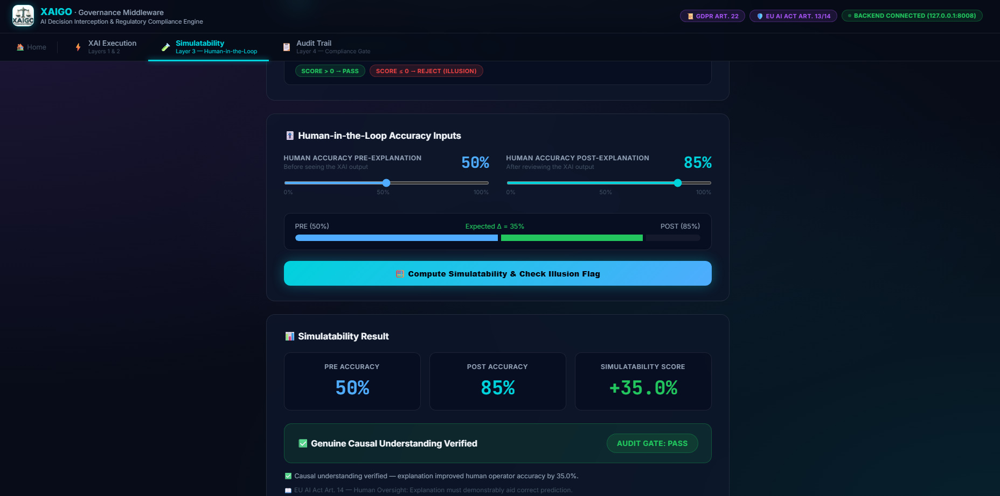
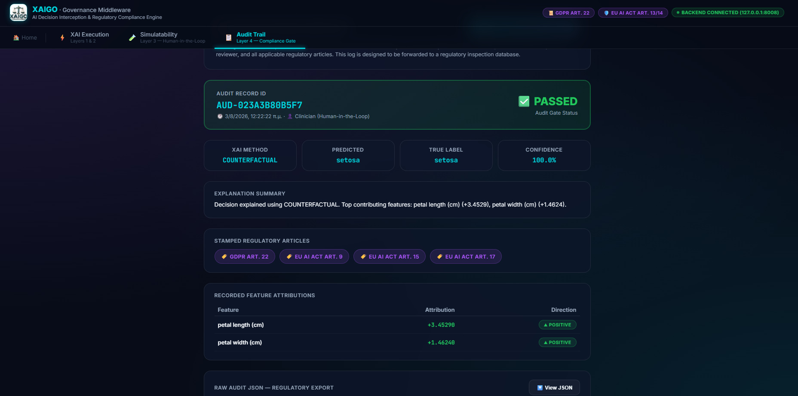

<div align="center">


# ⚖️ XAIGO — Explainable AI Governance Middleware

**Operationalizing Explainable AI (XAI), Human Causability & Regulatory Compliance for High-Risk AI Systems**

[](https://python.org)
[](https://fastapi.tiangolo.com)
[](https://reactjs.org)
[](https://vitejs.dev)
[](https://pytorch.org)
[](https://gdpr.eu)
[](https://artificialintelligenceact.eu)
[](LICENSE)

---

### 📖 Academic Thesis Research & Attribution
**Thesis Title:** *«Εξηγήσιμη Τεχνητή Νοημοσύνη»* (*Explainable Artificial Intelligence*)  
**Author:** **Filippos-Paraskevas Zygouris** (Φίλιππος-Παρασκευάς Ζυγούρης)  
**Registration Number:** 1084660 | **Institution:** Department of Computer Engineering & Informatics  

</div>

---

## 📋 Executive Summary & Theoretical Foundations

**XAIGO** is an enterprise-grade **AI Governance Middleware** designed to intercept, explain, evaluate, and audit machine learning decisions before they reach human decision-makers. Grounded in the thesis research of **Filippos-Paraskevas Zygouris**, XAIGO operationalizes theoretical XAI concepts into a production-ready software architecture that bridges the gap between complex black-box algorithms and strict legal mandates (**GDPR Article 22** and **EU AI Act Articles 9, 13, 14, and 17**).

### 🔬 Core Theoretical Principles (Thesis Insights)

1. **The Black-Box Dilemma**: Modern deep neural networks and complex ensemble models excel at predictive accuracy but lack intrinsic transparency. In high-risk domains (healthcare, credit scoring, legal compliance, autonomous control), unexplainable predictions create severe operational risks and legal liabilities (with EU AI Act fines reaching up to **€35M or 7% of global annual turnover**).
2. **Causability vs. Interpretability**: As established in the thesis, mere feature relevance (interpretability) is insufficient for human decision-making. Users require **Causability**—the capacity of an explanation to transfer genuine causal understanding to a human operator, enabling actionable recourse (*"What minimal changes will alter the model's decision?"*).
3. **Mitigating the "Illusion of Understanding"**: Convincing explanations can introduce cognitive overconfidence, leading human reviewers to blindly accept flawed AI outputs. XAIGO introduces an empirical **Simulatability Engine** to test whether an explanation demonstrably improves human prediction accuracy ($\text{Acc}_{\text{post}} - \text{Acc}_{\text{pre}} > 0$).
4. **Omni XAI 4-Layer Architecture**: A decoupled, multi-modal governance blueprint combining data standardisation, auto-explainer selection, human efficacy validation, and immutable audit logging.

---

## 🏗️ The 4-Layer Decoupled Architecture

XAIGO enforces compliance through a strict four-layer pipeline operating between black-box models and human operators:

```
                                    ┌─────────────────────────────────────────────────┐
                                    │               BLACK-BOX AI MODEL                │
                                    │    (RandomForest / PyTorch CNN / TF-IDF LogReg) │
                                    └────────────────────────┬────────────────────────┘
                                                             │
                                                             ▼
┌─────────────────────────────────────────────────────────────────────────────────────────────────────────────────┐
│                                           XAIGO GOVERNANCE MIDDLEWARE                                           │
├─────────────────────────────────────────────────────────────────────────────────────────────────────────────────┤
│  Layer 1: Input Data & Plausibility Gate                                                                        │
│  ├── Feature Validation & Standardisation (Tabular, Image, Text)                                                │
│  └── Immutable Feature Constraints (🔒 sepal length, age, etc.)                                                │
├─────────────────────────────────────────────────────────────────────────────────────────────────────────────────┤
│  Layer 2: XAI Controls & Causability Engine                                                                     │
│  ├── SHAP (TreeExplainer)         ➜ Game-theoretic Shapley Values (GDPR Art. 22)                               │
│  ├── LIME (Tabular & Text)        ➜ Local linear surrogate neighborhood models                                 │
│  ├── Grad-CAM (PyTorch Hooks)     ➜ 28x28 Conv activation heatmaps (EU AI Act Art. 13)                         │
│  └── Counterfactual Search        ➜ Minimal perturbations ($L_0, L_1, L_2$ metrics) (EU AI Act Art. 9 & 15)   │
├─────────────────────────────────────────────────────────────────────────────────────────────────────────────────┤
│  Layer 3: Simulatability Engine & Human-in-the-Loop                                                             │
│  ├── Accuracy Delta: Simulatability = Acc_post - Acc_pre                                                       │
│  └── Illusion of Understanding Detector: Triggers if Simulatability <= 0                                        │
├─────────────────────────────────────────────────────────────────────────────────────────────────────────────────┤
│  Layer 4: Compliance Audit Trail Gate                                                                           │
│  ├── SHA-256 Record Stamping (Record ID, ISO-8601 Timestamp, Attributions)                                     │
│  └── Automatic Gate Rejection: If Illusion = True ➜ Audit Gate REJECTS decision (decision_justified = False)     │
└────────────────────────────────────────────────────────┬────────────────────────────────────────────────────────┘
                                                         │
                                                         ▼
                                    ┌─────────────────────────────────────────────────┐
                                    │       HUMAN DECISION MAKER / AUDITOR PANEL      │
                                    │         (Interactive Web UI / REST Export)      │
                                    └─────────────────────────────────────────────────┘
```

---

## 🧮 Methodological Deep-Dive (XAI Techniques & Metrics)

### 1. Game-Theoretic Attributions (SHAP)
Utilizing Shapley Additive exPlanations (`shap.TreeExplainer`), XAIGO computes exact feature contributions based on cooperative game theory:
$$\phi_i(v) = \sum_{S \subseteq N \setminus \{i\}} \frac{|S|!(|N|-|S|-1)!}{|N|!} \left( v(S \cup \{i\}) - v(S) \right)$$
- **Regulatory Use**: Satisfies **GDPR Art. 22** by providing additive, globally consistent feature attributions.

### 2. Local Surrogate Models (LIME)
For model-agnostic local explanations, `LimeTabularExplainer` and `LimeTextExplainer` fit an interpretable sparse linear surrogate model $g \in G$ locally around the instance neighborhood:
$$\xi(x) = \arg\min_{g \in G} \mathcal{L}(f, g, \pi_x) + \Omega(g)$$
- **Regulatory Use**: Explains complex non-linear tabular decisions and text classification instances.

### 3. Visual Activation Heatmaps (Grad-CAM)
For convolutional neural networks (PyTorch `SimpleCNN`), XAIGO hooks feature map activations $A^k$ and gradients $w_k^c$ of the final convolutional layer:
$$w_k^c = \frac{1}{Z} \sum_{i} \sum_{j} \frac{\partial Y^c}{\partial A_{i,j}^k}$$
$$L_{\text{Grad-CAM}}^c = \text{ReLU}\left( \sum_k w_k^c A^k \right)$$
- **Canvas Rendering**: Upsampled to $28 \times 28$ and rendered via an HTML5 canvas Jet colormap overlay (Blue = Low, Cyan = Mid, Red = High).
- **Regulatory Use**: Satisfies **EU AI Act Art. 13** for visual inspection of image AI models.

### 4. Counterfactual Recourse & Distance Metrics
Generates minimal plausible perturbations to flip model predictions while enforcing **immutable feature constraints** (e.g. 🔒 `sepal length` cannot be modified):
- **$L_0$ Sparsity Metric**: Counts the number of modified features.
- **$L_1$ Manhattan Distance**: $$\|x - x'\|_1 = \sum_{i} |x_i - x'_i|$$
- **$L_2$ Euclidean Distance**: $$\|x - x'\|_2 = \sqrt{\sum_{i} (x_i - x'_i)^2}$$
- **Regulatory Use**: Satisfies **EU AI Act Art. 9 & 15** by offering actionable recourse paths.

---

## 📸 Application Screenshots & User Interface Showcase

Below is a visual overview of the XAIGO platform interface:

### 1. Landing Page Hero Section
Featuring ambient glassmorphism styling, header branding, and feature grid:
<div align="center">
  
</div>

### 2. Video Demonstration Showcase
Embedded demonstration video showcasing all 4 governance layers in action:
<div align="center">
  
</div>

### 3. Layer 2: Feature Attribution & LIME / SHAP View
Interactive attribution bars highlighting positive (green) and negative (red) contributions:
<div align="center">
  
</div>

### 4. Layer 2: Counterfactual Recourse & What-If Explorer
Minimal plausible changes with distance metrics ($L_0, L_1, L_2$) and immutable constraint validation:
<div align="center">
  
</div>

### 5. Layer 3: Simulatability Engine & Illusion Detection
Human-in-the-loop accuracy testing panel with live **Illusion of Understanding** alert detection:
<div align="center">
  
</div>

### 6. Layer 4: Compliance Audit Trail Gate & Raw JSON Exporter
SHA-256 stamped immutable logs with automatic gate clearance (`PASS` / `REJECT`) and regulatory tags:
<div align="center">
  
</div>

---

## 📁 Repository Structure & Folder Organization

```
XAI/
├── assets/                             # Brand assets & demo media
│   ├── logo.png                        # XAIGO official logo (PNG format)
│   ├── logo.jpeg                       # XAIGO official logo (JPEG format)
│   └── demo_video.mp4                  # Full application walkthrough video
├── backend/                            # FastAPI Middleware REST API Service
│   └── main.py                         # Unified API backend serving XAI, Simulatability & Audit endpoints
├── config/                             # System Configuration files
│   ├── model_config.yaml               # Model hyperparameters & paths
│   └── xai_config.yaml                 # Explainer parameters & threshold defaults
├── docs/                               # Thesis & Regulatory technical files
│   ├── 1084660_ΖΥΓΟΥΡΗΣ.pdf             # Original Thesis PDF ("Explainable Artificial Intelligence")
│   ├── 1084660_ΖΥΓΟΥΡΗΣ.pptx            # Thesis defense presentation slides
│   ├── PRRC_Technical_File.html        # Regulatory compliance documentation
│   ├── technical_folder.html           # System architecture reference file
│   └── technical_folder_xai.html       # XAI technical specifications
├── frontend/                           # React + Vite Web Application
│   ├── public/                         # Static web assets (logo.jpeg, demo.mp4)
│   ├── src/
│   │   ├── api.js                      # API client routing & error handler
│   │   ├── App.jsx                     # Top-level state router (Landing / XAI / Simulatability / Audit)
│   │   ├── index.css                   # Glassmorphism design system CSS
│   │   ├── main.jsx                    # React entry point
│   │   ├── components/                 # Reusable UI components
│   │   │   ├── Navbar.jsx              # Header with logo, status badge & navigation tabs
│   │   │   ├── ControlPanel.jsx        # Interactive Modality & Technique selector
│   │   │   ├── ResultsPane.jsx         # Dynamic switcher for XAI visualizers
│   │   │   ├── GradCamView.jsx         # HTML5 Canvas Jet Colormap heatmap renderer
│   │   │   ├── SimulatabilityPanel.jsx # Inline Level 3 widget
│   │   │   └── AuditPanel.jsx          # Inline Level 4 audit widget
│   │   └── pages/                      # Full-page views
│   │       ├── LandingPage.jsx         # Hero view with video player & feature cards
│   │       ├── XAIPage.jsx             # Dedicated XAI Execution View (Layers 1 & 2)
│   │       ├── SimulatabilityPage.jsx  # Dedicated Human Efficacy View (Layer 3)
│   │       └── AuditPage.jsx           # Dedicated Compliance Audit Gate View (Layer 4)
│   ├── package.json                    # Frontend dependencies
│   └── vite.config.js                  # Vite bundler config
├── screenshots/                        # Application UI Screenshots
│   ├── home.jpg                        # Landing Page Hero View
│   ├── home video.jpg                  # Landing Page Video Showcase
│   ├── lime.jpg                        # LIME & SHAP Feature Attribution View
│   ├── conterfactual.jpg               # Counterfactual Recourse View
│   ├── layer3.jpg                      # Level 3 Simulatability Engine View
│   └── layer4.jpg                      # Level 4 Audit Trail Gate View
├── src/                                # Core Python XAI Implementation Library
│   ├── core/
│   │   ├── input_layer.py              # Data loaders (Iris, MNIST, 20-Newsgroups) & ClinicalDataLayer
│   │   ├── auto_explainer.py           # Automatic XAI technique selector
│   │   └── explainers.py               # Explainer wrappers
│   ├── experiments/
│   │   ├── evaluation.py               # Simulatability calculation & Illusion detection
│   │   └── simulations.py              # Simulation scripts
│   ├── governance/
│   │   ├── audit_trail.py              # AuditRecord dataclass & report generator
│   │   ├── compliance.py               # GDPR / EU AI Act compliance checker & scoring
│   │   └── framework.py                # Risk Pyramid classification & control mappings
│   ├── methods/
│   │   ├── counterfactual.py           # Greedy counterfactual perturbation algorithm
│   │   ├── model_agnostic.py           # SHAP (Tree/Kernel) & LIME (Tabular/Text) explainers
│   │   └── model_specific.py           # PyTorch CNN Grad-CAM backward hook manager
│   ├── models/
│   │   ├── train_model.py              # RandomForest, PyTorch CNN, and TF-IDF LogReg trainers
│   │   └── load_model.py               # Persistence helpers
│   └── visualization/
│       ├── dashboard.py                # Dashboard layouts
│       └── plotting.py                 # Plotly visualizers
├── tests/                              # Automated Unit Test Suite
│   └── test_governance.py              # Verification tests for audit gate, simulatability & constraints
├── LICENSE                             # MIT License
├── README.md                           # Comprehensive documentation (this file)
└── requirements.txt                    # Backend Python dependencies
```

---

## 🛠️ API Endpoint Reference (FastAPI Backend)

The backend runs on port `8008` and exposes structured REST endpoints:

| Method | Endpoint | Description | Sample Payload / Query |
|---|---|---|---|
| `GET` | `/api/health` | System status & model accuracy probe | `N/A` |
| `GET` | `/api/datasets` | Dataset samples & metadata per modality | `?modality=tabular` |
| `POST` | `/api/explain` | Computes live SHAP, LIME, Grad-CAM, or Counterfactual explanations | `{"modality":"tabular","method":"SHAP","instance_index":0}` |
| `POST` | `/api/simulatability` | Evaluates accuracy delta & Illusion of Understanding status | `{"accuracy_pre":0.5,"accuracy_post":0.85}` |
| `POST` | `/api/audit` | Stamping immutable digital audit record with compliance tags | `{"model_type":"RandomForest","xai_method":"SHAP",...}` |
| `GET` | `/api/compliance/checklist` | GDPR & EU AI Act compliance checklist | `N/A` |
| `GET` | `/api/compliance/risk-categories` | EU AI Act 4-tier risk classification pyramid | `N/A` |
| `GET` | `/api/compliance/governance-controls` | Regulatory control mappings | `N/A` |

> 📖 **Interactive Swagger Documentation**: [http://127.0.0.1:8008/docs](http://127.0.0.1:8008/docs)

---

## 🚀 Quickstart Guide

### 1. Environment Setup
```bash
git clone https://github.com/FilippeZ/xai.git
cd XAI

# Create virtual environment
python -m venv venv
# Activate (Windows):
venv\Scripts\activate
# Activate (Linux/macOS):
source venv/bin/activate

# Install Python requirements
pip install -r requirements.txt
```

### 2. Start Backend API Server
```bash
python -m uvicorn backend.main:app --port 8008 --reload
```
*Backend active at [http://127.0.0.1:8008](http://127.0.0.1:8008).*

### 3. Build & Run Frontend Application
In a separate terminal:
```bash
cd frontend
npm install

# Option A: Development Server
npm run dev

# Option B: Build static bundle & serve
npm run build
python -m http.server 3000 --directory dist
```
*Frontend active at [http://127.0.0.1:3000](http://127.0.0.1:3000).*

---

## 🧪 Automated Testing

Run the unit test suite to verify governance controls, distance metrics, and audit gate rejection:

```bash
pytest tests/test_governance.py -v
```

---

## 📜 Regulatory Mapping Matrix

| Regulation | Article | Mandate | Technical Solution in XAIGO |
|---|---|---|---|
| **GDPR** | **Art. 22** | Right to Explanation | SHAP & LIME feature attributions delivering interpretable decision justifications. |
| **EU AI Act** | **Art. 9** | Risk Management | Counterfactual recourse analysis establishing minimal plausible paths for decision change. |
| **EU AI Act** | **Art. 13** | Transparency | Grad-CAM activation heatmaps enabling visual inspection of vision AI models. |
| **EU AI Act** | **Art. 14** | Human Oversight | Level 3 Simulatability Engine detecting Illusion of Understanding to prevent human over-reliance. |
| **EU AI Act** | **Art. 15** | Accuracy & Robustness | Plausibility gate enforcing immutable feature preservation during recourse generation. |
| **EU AI Act** | **Art. 17** | Quality Management System | Level 4 Audit Gate stamping SHA-256 decision records for regulatory inspection. |

---

## 📄 License & Attribution

Distributed under the **MIT License**. See `LICENSE` for details.

- **Author**: **Filippos-Paraskevas Zygouris** (Φίλιππος-Παρασκευάς Ζυγούρης)
- **Registration Number**: 1084660
- **Academic Context**: Thesis *"Explainable Artificial Intelligence"*, Department of Computer Engineering & Informatics.
